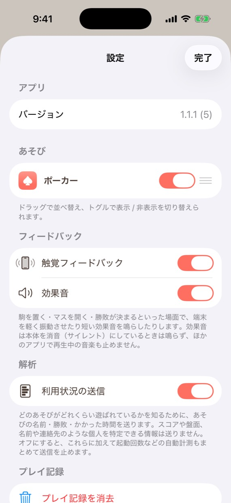

# #158 解析イベントの最小設置 — UI 確認

対象: 設定画面に追加した「解析」セクション（`利用状況の送信` トグル）。
撮影環境: iPhone 17 Pro / iOS 26.5 シミュレータ / `-screenshotMode -showSettings`（広告は無効）。

見どころ:

- 既存の「フィードバック」と同じ体裁のトグル1つ（既定はオン）。
- 説明文で**送るもの（あそびの名前・勝敗・かかった時間）と送らないもの（スコア・盤面・個人を特定できる情報）**を明示している。
- オフにすると `game_start` / `game_end` だけでなく Firebase の自動計測（起動回数など）も止まるため、
  そのことも説明文に書いてある（PR #162 の CodeRabbit 指摘で追加）。
- 順序は アプリ → あそび → フィードバック → **解析** → プレイ記録 → 規約 → その他。
  「プレイ記録」（端末内に保存・送信しない）と「解析」（送信する）が隣に並び、
  保存と送信の区別が読み取れる位置にした。

## 撮影上の注意（この画像だけ実機と違う点）

「解析」セクションは設定リストの中ほどにあり、**当番セッションのシミュレータはタップ・
スクロールの自動操作ができない**（`xcrun simctl` にその手段が無い）。そのため撮影時のみ
「あそび」セクションの行数を 10 → 1 に絞ったビルドで撮っている（`settings.orderedIDs.prefix(1)`）。

- **この一時変更はコミットに含まれていない**（撮影後に元へ戻し、`git diff` で確認済み）。
- 変わるのは「あそび」欄の行数だけで、追加した「解析」セクションの見た目・文言・
  セクションの並び順は実機と同じ。
