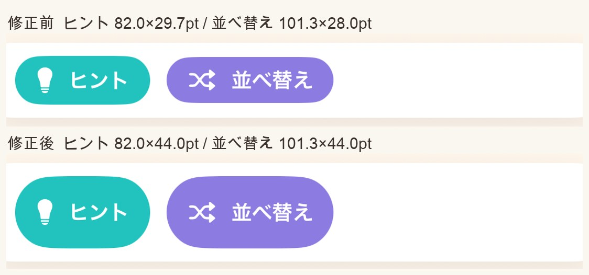
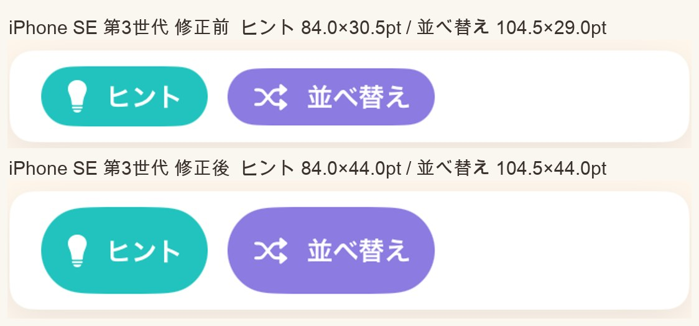
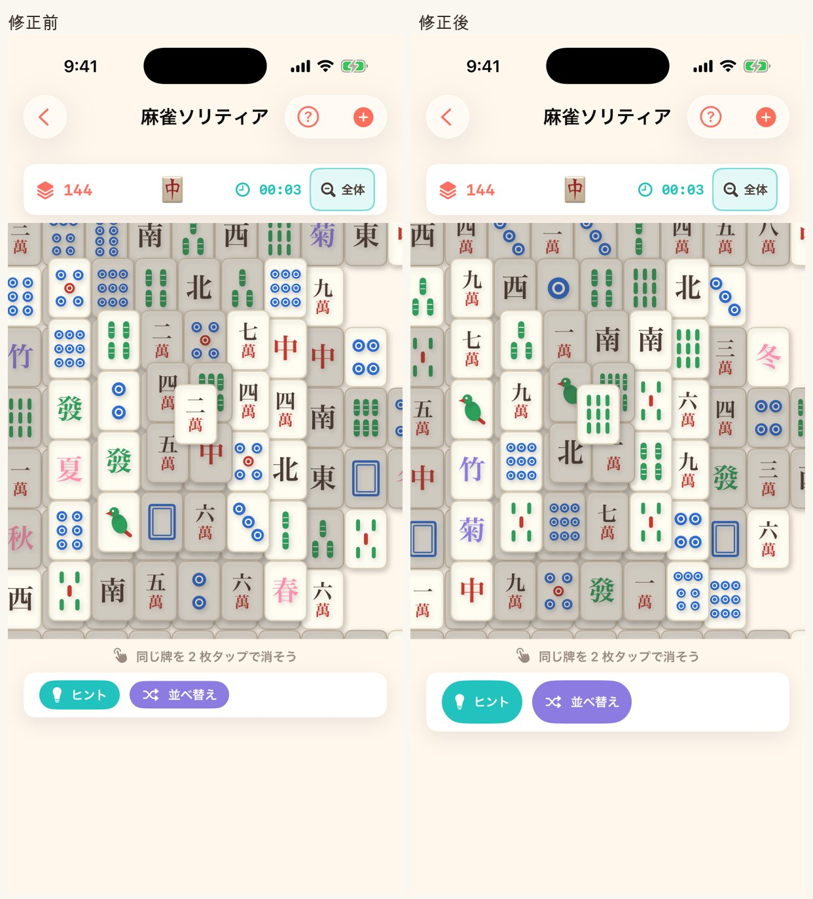
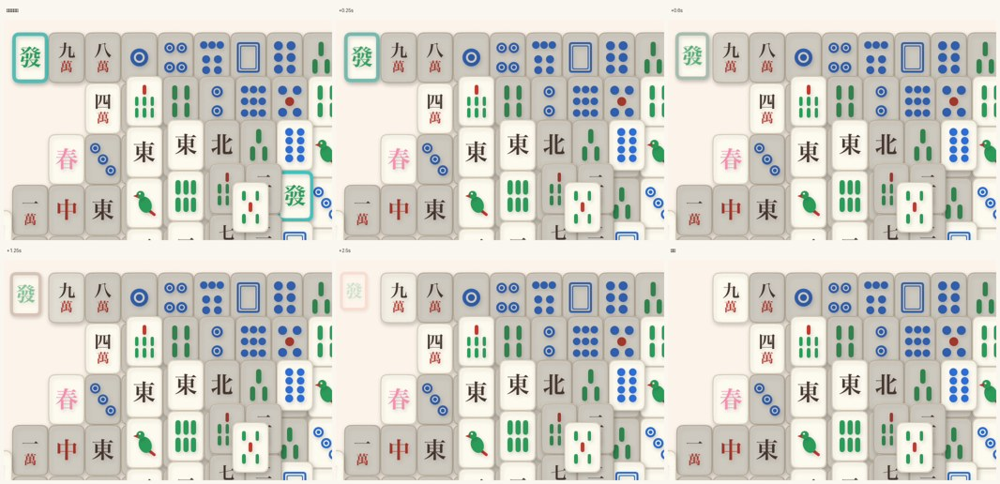

# #199 麻雀ソリティア: 牌の取得アニメーションと操作ボタンのタップ領域 — 画面確認

**数値の出し方**: pt = 実測ピクセル ÷ 画面の倍率（iPhone 17 Pro は 3、iPhone SE 第3世代は 2）。
ボタンは面（`Theme.teal` = `#22C3BE` / `Theme.purple`）の連結成分の外接矩形で測る。
操作カードの帯は「カードの白が続く区間」の境界で測る（#196 / #197 README と同じ測り方）。
修正前は `origin/release/v1.1.2`（`e50186a`）を**別ワークツリーで別ビルド**し、
同じシミュレータへ uninstall → install してから撮っている。

## 1. ヒント・並べ替えボタンのタップ標的（受け入れ条件 3）

| | 修正前 | 修正後 | Apple HIG |
|---|---|---|---|
| ヒント（iPhone 17 Pro） | 82.0 × **29.7pt** | 82.0 × **44.0pt** | 44 × 44pt 以上 |
| 並べ替え（iPhone 17 Pro） | 101.3 × **28.0pt** | 101.3 × **44.0pt** | 同上 |
| ヒント（iPhone SE 第3世代） | 84.0 × **30.5pt** | 84.0 × **44.0pt** | 同上 |
| 並べ替え（iPhone SE 第3世代） | 104.5 × **29.0pt** | 104.5 × **44.0pt** | 同上 |

- Issue 本文の見積り「約 29pt」と実測が一致する。足りていなかったのは**高さだけ**で、
  幅は元から 82〜104pt あった。そのため**横幅は 1pt も変えていない**（下記 3 の理由）。
- 高さは `Metrics.controlButtonMinHeight`（= `minimumTapTarget` = 44）に集約し、
  View がその定数を `.frame(minHeight:)` に渡していること自体をソース走査で固定した
  （#197 の `displayToggleMeetsTapTarget` と同じやり方。定数だけ突き合わせても、View 側を
  `minHeight: 30` のようにハードコードで書き換える改変は素通りするため）。
- 追加した 3 つのテストは、実際に壊してみて**赤くなることを確認済み**:
  `minHeight: 30` へ書き換え / `.transition` を `.offset` の後ろへ移動 / `.gameAnimation` を削除。

### 盤面は縮んでいない

| 端末 | 操作カードの高さ | 操作カードの**上端** | 盤面領域 |
|---|---|---|---|
| iPhone 17 Pro | 45.0 → **59.3pt** | 649.3pt（**変化なし**） | **変化なし** |
| iPhone SE 第3世代 | 45.5 → **59.0pt** | 476.0pt（**変化なし**） | **変化なし** |

カードが 14pt 高くなっても盤面が縮まないのは、`controlArea` の高さが
「リザルト + レコメンドカード」の不可視ひな形（≒109pt）で決まっているため（#148）。
修正後の操作カード 59.3pt はその内側に収まる。上端の pt が修正前後で完全に一致していることが
その裏取りで、牌の大きさ（`comfortableTileWidth` = `max(44, …)`）も高さに依存しない。

## 2. 牌の取得・ヒント枠のアニメーション（受け入れ条件 1・2）

**撮り方**: シミュレータは自動タップができないため、**コミットしない一時プローブビルド**で
（a）アニメーションを 0.2s → **4.0s** に伸ばし、（b）起動 3 秒後に `showHint()`、その 5 秒後に
ヒントの 2 枚を順にタップする `.task` を足して録画し、8fps でフレームに割った。
盤面全体が見える `-mahjongWholeBoard` 起動で撮っているため、消える 2 枚が必ず画面内に入る。
プローブは撮影後に取り除いてあり、**この PR の差分には含まれない**（`grep -c mahjongAnimationProbe` = 0）。

- **「タップ直前」のコマ**: 發の 2 枚に `Theme.teal` の太い枠が出ている = ヒント表示。
  修正前はこの枠が瞬時に切り替わっていた（受け入れ条件 2）。
- **+0.25s → 完了のコマ**: 發の 2 枚が**縮みながら薄くなって**消えていく（受け入れ条件 1）。
  実際の再生時間は 0.2s なので、上の帯は 20 倍のスローに相当する。
- 消えた後の残り枚数が 144 → 142 になっていることも同じ録画で確認済み。

### Reduce Motion

演出は `Core/Motion.swift` の `.gameAnimation(_:value:)` 経由でのみ書いており、
「視差効果を減らす」が ON のときはアニメーションが `nil` に落ちて即時反映になる（#210）。
素の `withAnimation` / `.animation(` を使っていないことは `MotionTests.noRawAnimationOutsideCore`
が全ソースを走査して固定している（本 PR でも緑）。

## 3. 途中で見つけて直した退行

横パディングを 12 → 16 に広げた最初の実装では、ヒントを 1 回使って右端に
「ヒント1 / 並べ替え0」が出た状態で **「並べ替え」が 2 行に折り返した**（プローブ録画で発覚）。
足りていなかったのは高さだけなので**横パディングは 12 のまま**に戻し、
さらに次の 2 点で押さえた:

- ボタンのラベルに `.lineLimit(1)` + `.fixedSize(horizontal: true, vertical: false)`
- 回数表示のほうに `.lineLimit(1)` + `.minimumScaleFactor(0.7)`（幅が足りないときに縮むのは
  ボタンではなくこちら）

修正後にヒントを 1 回使った状態でも折り返さないことを録画で確認済み（ヒント 82.0 × 43.7pt /
並べ替え 101.3 × 43.7pt。0.3pt の差は動画フレームの圧縮由来で、静止画では 44.0pt）。

## 撮影環境

- iPhone 17 Pro（iOS 26.x・倍率 3）/ iPhone SE 第3世代（倍率 2）
- Debug ビルド + `-screenshotMode`（広告を出さず ATT も聞かない。シミュレータは AdMob 側で
  テストデバイス扱いになり、Release でもバナーに `Test mode` の帯が写るため）
- ステータスバーは 9:41・電波フル・満充電に固定
