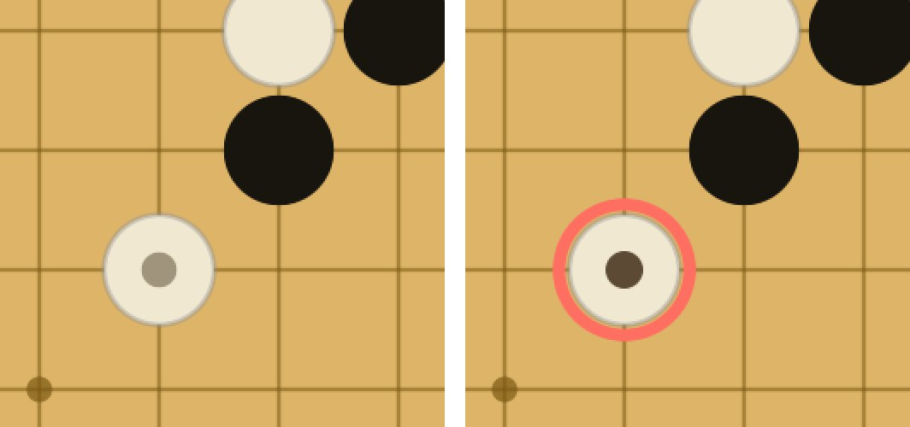
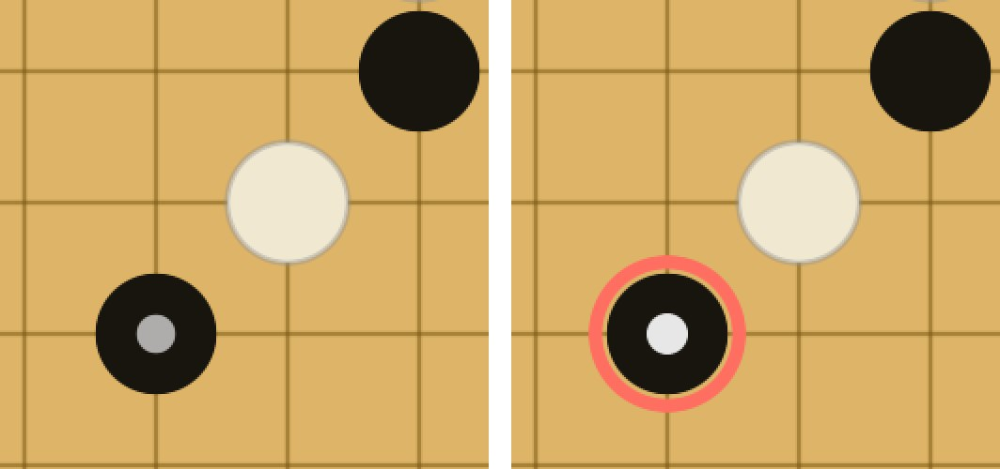
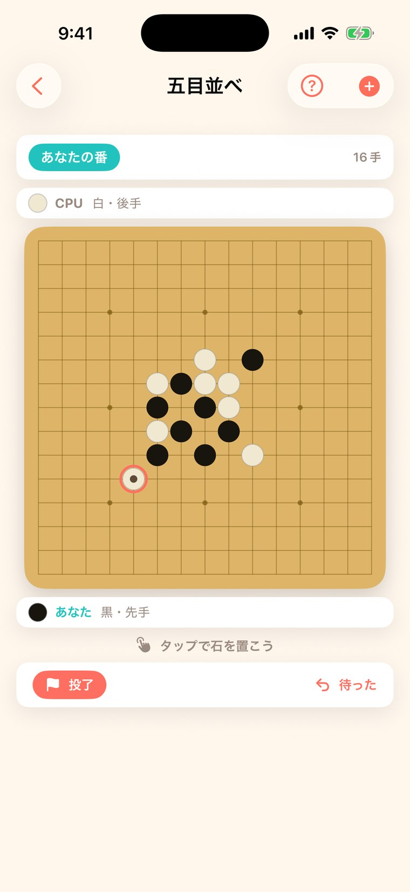
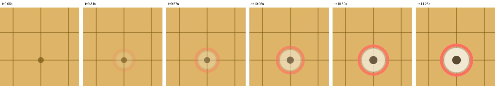
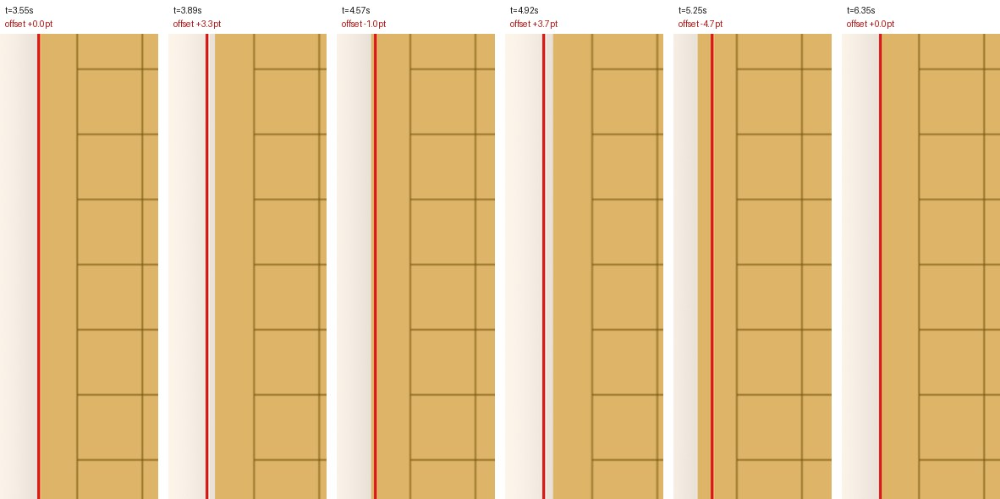

# #202 五目並べ: 石を置く演出・直前手マーカー・無効タップのフィードバック — 画面確認

**撮影環境**: iPhone 17 Pro（iOS 26.5・倍率 3）/ Debug ビルド・`-screenshotMode`（広告なし）。
pt = 実測ピクセル ÷ 3。修正前は `origin/release/v1.1.1`（`b9a57f8`）を**別ワークツリーで別ビルド**し、
同じシミュレータへ uninstall → install → 同じ中断スナップショットを注入してから撮っている。
盤面は `Scripts/aso-demo-snapshots.py` のデモ棋譜（16手）を使い、修正前後で完全に同じ局面にしてある。

## 1. 直前手マーカー（受け入れ条件 2）

### 白石が直前手のとき

左 = 修正前 / 右 = 修正後（直前手 = 白の (10,4)）。

### 黒石が直前手のとき（従来ほぼ見えなかったケース）

左 = 修正前 / 右 = 修正後（直前手 = 黒の (11,3)。デモ棋譜に黒の1手を足した局面）。

| | 修正前 | 修正後 |
|---|---|---|
| 外周のリング | **なし** | `Theme.coral` の 2.4pt リング（石の外側 +2pt） |
| 中央のドット | 石半径の 0.32 倍 | 石半径の **0.34 倍** |
| ドットの濃さ（黒石の上） | 白 65% | 白 **90%** |
| ドットの濃さ（白石の上） | `#2A1600` 40% | `#2A1600` **75%** |

修正前は「石の内側の小さな薄いドット」だけなので、とくに**黒石の上では地の黒と溶けて**
ほとんど識別できなかった（02 の左）。盤色（`#DEB568`）・黒石・白石のいずれとも十分な差が出る
アクセント色を**石の外周**に置くことで、どちらの色の石でも同じ強さで見えるようにしている。

### 直前手マーカー以外は 1px も変わっていない

修正前後の**画面全体**（1206×2622px）を差分したところ、差の出た範囲は
**bbox (351, 1366) – (435, 1450) = 84×84px の1か所だけ**（全体の 0.07%）だった。
これは直前手の石そのものの位置であり、盤・格子・石・ステータスバー・操作カードは一切動いていない。

## 2. 石を置く演出（受け入れ条件 1）

**撮り方**: シミュレータは自動タップができないため、**コミットしない一時プローブビルド**で
（a）出現アニメーションを 0.18s → **2.0s** に伸ばし、（b）起動 3 秒後に埋まっているマスを、
その 5 秒後に空きマス (11,11) をタップする `.task` を足して、約 0.25 秒間隔で連続スクリーンショットを撮った。
プローブは撮影後に取り除いてあり、**この PR の差分には含まれない**（`grep -rn gomokuAnimationProbe` = 0 件）。

石が**縮んだ状態・透明から、実寸・不透明へ**現れていく（実際の再生時間は 0.18s なので上の帯は約11倍のスロー）。

| 時刻 | 石の直径（外接矩形の実測） |
|---|---|
| t=9.05s（開始直後） | 26.7pt |
| t=9.57s | 35.0pt |
| t=10.06s | 36.3pt |
| t=10.50s | 37.3pt |
| t=11.26s（完了） | **38.0pt** |

実装上の要点: `Canvas` は**ビュー本体が作り直されない限り描き直されない**ため、外から
`.gameAnimation` を掛けても石は瞬間表示のままになる。盤の描画を `GomokuBoardCanvas` として
切り出し `Animatable`（`animatableData` = 手数）に適合させることで、手数の補間ごとに `body` が
評価され、直前手の石だけがスケール + フェードで現れる。

## 3. 無効なタップへのフィードバック（受け入れ条件 3）

**撮り方**: 上と同じプローブで、横揺れを 0.32s → **2.4s** に伸ばして撮影。
赤い縦線は**静止時の盤の左端**（x=71px）に引いた基準線。

| 時刻 | 盤の左端 | 静止位置からのずれ |
|---|---|---|
| t=3.55s（タップ前） | 71px | ±0.0pt |
| t=3.89s | 81px | +3.3pt |
| t=4.57s | 68px | −1.0pt |
| t=4.92s | 82px | +3.7pt |
| t=5.25s | 57px | **−4.7pt** |
| t=6.35s（完了） | 71px | **±0.0pt** |

振れ幅は設計どおり最大 ±5pt で、**完了後はぴったり元位置（71px）に戻っている**。
`GomokuShake` は `sin(2π × 3 × 拒否の通し番号)` で位置を出しているため、通し番号が整数に
戻った時点で必ず 0 になる（振れっぱなしにならない）。

触覚・効果音は Model 側の `feedback.notify(.warning)` から鳴る。対象は次の3つ:

| 無効なタップ | 修正前 | 修正後 |
|---|---|---|
| 既に石がある交点 | `notify(.warning)`（視覚的な反応なし） | `notify(.warning)` + 横揺れ |
| 盤の外 | **完全に無反応**（View で早期 return） | `notify(.warning)` + 横揺れ |
| CPU の手番・思考中 | **完全に無反応**（View で早期 return） | `notify(.warning)` + 横揺れ |
| 決着後 | 無反応 | 無反応のまま（結果表示中の雑音を避けるため意図的に据え置き） |

判定は `GomokuModel.tap(row:col:)` に集約した。`FeedbackService` の規約
（「各ゲームは判定済みの Model 側からのみ呼ぶ。View のタップハンドラに撒くと無効操作を拾い漏らす」）
のとおりで、実際に**盤外と CPU 手番の2つを取りこぼしていたのが今回の症状**だった。

## 4. Reduce Motion（#210 の規約）

追加した2つの演出はどちらも `Core` の `.gameAnimation(_:value:)` 経由で書いてあり、
「視差効果を減らす」が ON のときはアニメーションが `nil` に落ちる（＝石は即時表示・盤は揺れない）。
触覚と効果音は Model 側から鳴るため、揺れが止まっても拒否は伝わる。
素の `withAnimation` / `.animation(` が混じっていないことは `MotionTests` のソース走査テストが
機械的に担保している（`swift test` 実行済み・484 テスト green）。
