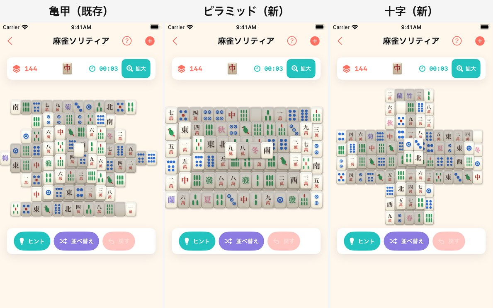
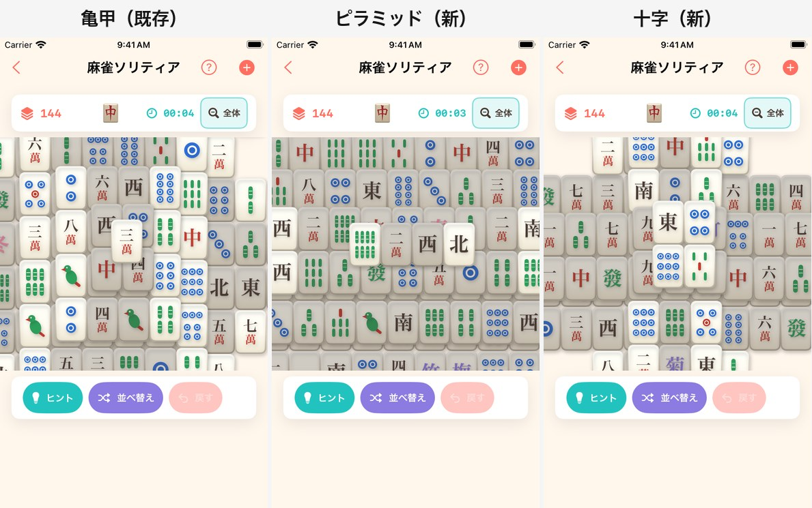

# #239 麻雀ソリティア: 盤面レイアウトを3種類にする — 画面確認

**撮影環境**: iPhone SE 第3世代（375pt 幅・倍率 2）/ iOS 26 / Debug ビルド + `-screenshotMode`
（広告と ATT を出さない）。起動引数は `-startGame mahjong -mahjongLayout <id>` で、
全体表示の面は `-mahjongWholeBoard` を併用。シミュレータは自動タップができないため、
「＋」メニューからの選択操作は起動引数で代替している（`-mahjongWholeBoard` と同じ手・#196/#197 の踏襲）。

## 3種類のレイアウト

`01-three-layouts-whole.jpg`（左から 亀甲 / ピラミッド / 十字・いずれも全体表示）。
ステータスバーの残り枚数がどれも **144** であること、盤面が画面の枠から外へはみ出していないことが読み取れる。

| かたち | id | 段ごとの枚数 | 盤の広さ（牌何枚ぶん） |
|---|---|---|---|
| 亀甲（既存・変更なし） | `turtle` | 87 / 36 / 16 / 4 / 1 | 15.0 × 8.0 |
| ピラミッド（新） | `pyramid` | 78 / 44 / 18 / 4 | 13.0 × 6.0 |
| 十字（新） | `cross` | 90 / 44 / 6 / 4 | 15.0 × 10.0 |

亀甲の座標は 1 つも動かしていない（既存テストの座標指定 `index(layer:hx:hy:)` がそのまま通る）。

## 既定表示（牌 44pt・スクロール）

`02-three-layouts-default.jpg`。#196 で決めた「既定は牌 44pt・全体像はトグルで取り戻す」は
どのかたちでも据え置き。牌の幅は `max(44pt, 全体が収まる幅)` なので、**かたちが変わっても 44pt を割らない**
（`everyLayoutKeepsTheTapTarget` が 320pt 幅で全レイアウト・全牌について実測している。
受け入れ条件が挙げる「iPhone SE 相当（320pt）」は実在の最小機（375pt）より狭い側で見ている）。

## クリア可能性の検証

画面では 1 局ぶんしか確認できないため、**取り切れること自体はテストで担保**している。

| テスト | 内容 |
|---|---|
| `everyLayoutGeneratesSolvableBoards` | 3 かたち × 100 通りの種で盤面を生成し、**解法を実際に再生**して 144 枚を取り切れることを確認（各手で「本当に取れる牌か」「絵柄が合うか」も検証） |
| `everyLayoutRearrangesIntoSolvableBoards` | 途中まで進めた盤面を並べ替え、そこから取り切れることを確認 |
| `everyLayoutHasTheStandardTileCount` | どのかたちも 144 枚ちょうど（72 組と一致） |
| `noLayoutHasFloatingTiles` / `noLayoutStacksTwoTilesInOnePlace` | 宙に浮いた牌・同じ場所の二重置きが無い |
| `everyLayoutFitsInsideItsCanvas` | 全部の牌が盤面の枠に収まる（描画のスケール計算の前提） |

生成方式（満杯の盤から「そのとき取れる 2 枚」を剥がし、剥がせた順に絵柄を割り当てる）は
レイアウト非依存のまま。位置の集合と派生値を `MahjongSolitaireLayout` に束ね、
`MahjongSolitaireRules` が引数で受け取る形にしただけで、アルゴリズムには手を入れていない。

## 選択の導線

右上の「＋」がメニューになり、亀甲 / ピラミッド / 十字 を選ぶと**そのかたちで新しい盤面を配る**。
いま遊んでいるかたちにはチェックが付く。途中の盤面があるときは従来どおり確認ダイアログを挟み、
そこに「『十字』を配ります。」とどれを選んだかを出す。

盤の下の操作カード（ヒント / 並べ替え / 戻す）に 4 つ目を足さなかったのは、#198 の実測で
iPhone の幅に 3 つでぎりぎりだったため（4 つ目を置くと文字が 2 行に折り返す）。
「＋」は元から「新規ゲーム」の入口なので、意味の増え方としても自然な場所を選んでいる。

「くわしいルール」にも「盤面のかたち」の項目を足し、3 種類あることと
**最短タイムがかたちごとに分かれる**ことを本文で説明している（`MahjongSolitaireRuleSheetTests` が文言を検証）。
