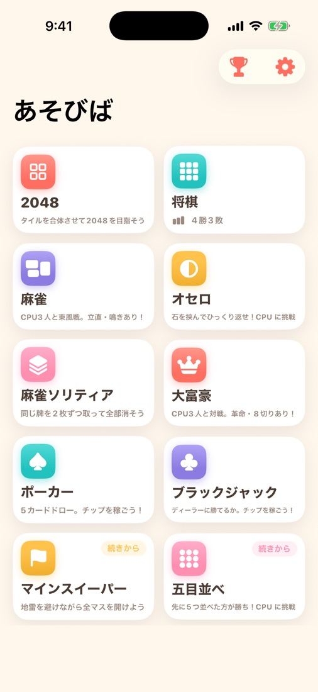
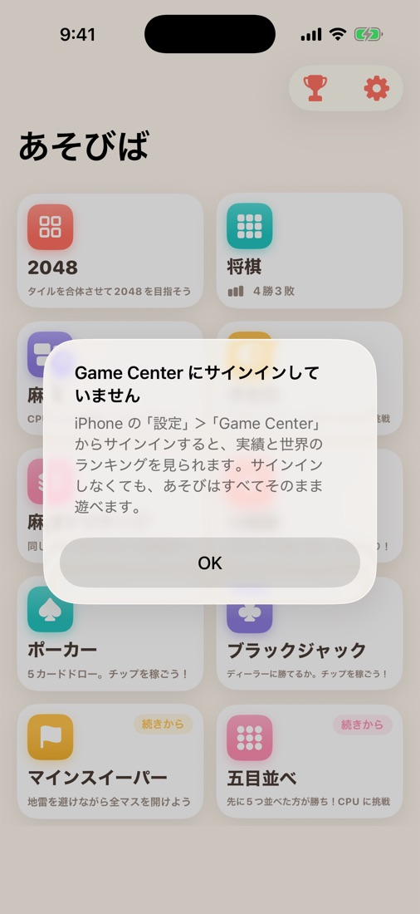

# #334 実績・ランキングをアプリ内から見られるようにする — 画面確認

v1.1.1 で実績4種・リーダーボード10種の**送信**は完成していたが、アプリ内から**見る手段が無かった**。
ハブのツールバーに「実績・ランキング」を追加した（iPhone 17 / iOS 26.5・ライトモード）。

## 1. ハブのツールバー

トロフィーを歯車の**左**に置いた。既存の設定ボタンは右端のまま位置が動いていない。
アイコンだけのボタンなので `accessibilityLabel("実績・ランキング")` を付けてある
（付けないと VoiceOver が `trophy.fill` と読む）。

## 2. 未サインインで押したときの案内

起動引数 `-screenshotMode -simulateGameCenterEntry`（DEBUG 限定）でツールバーのタップと
同じ分岐を通した。シミュレータは Game Center に未サインインのため、この経路になる。
**起動時には何も出ない**（1枚目が通常起動。受け入れ条件「起動時の挙動は変えない」）。

## 3. サインイン判定を外すとどうなるか（プローブ実測）

`GameCenterEntry.open()` の `guard GameCenterAuth.isSignedIn` を外した一時ビルドで同じ
起動引数を流したところ、**画面はハブのまま完全に無反応**だった（Game Center も案内も出ない）。
未サインインで `GKAccessPoint.trigger` を呼んでも何も起きないため、判定を先に置いて
必ず何かを返す形にしている。このプローブはコミットしていない。

## 実測できていないこと

**サインイン済みでダッシュボードが開くところは、この環境では確認できていない**。
シミュレータの Game Center サインインには Apple ID が要り、AI からは操作できないため。
リリース前の実機確認（会長の関所）で見てほしいのはこの1点。
