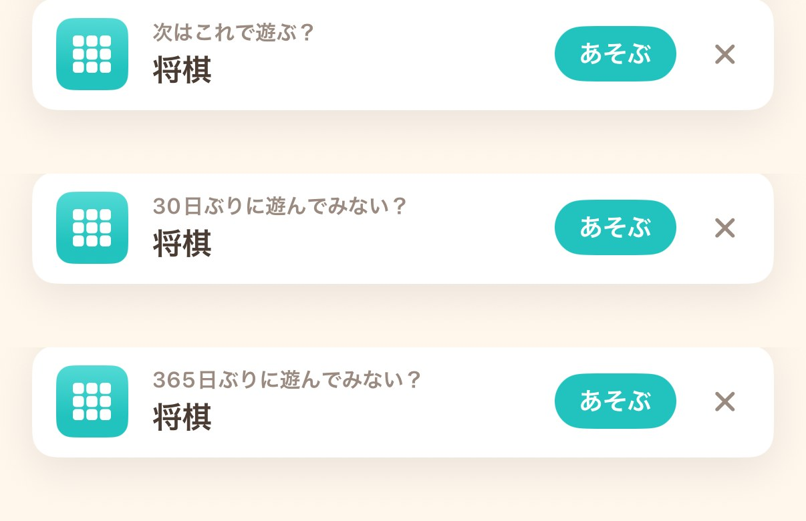
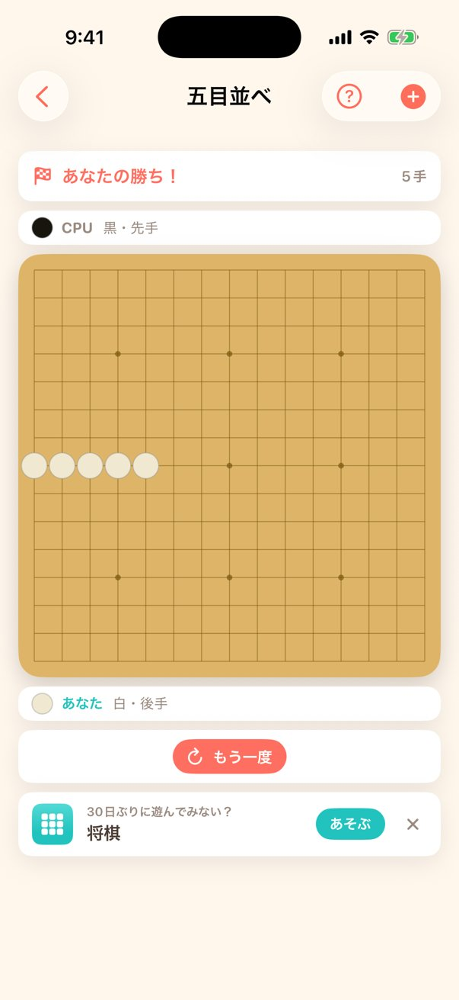

# #335 レコメンドの「久しぶり枠」— 画面確認

全ゲーム踏破後もレコメンドが出るようにし、見出しを理由で出し分けた（#335）。
カードの寸法・レイアウトは変えていない。**変わるのは見出しの1行だけ**。

## 見出しの比較（五目並べのリザルト・iPhone 17 / iOS 26.5）



上から順に:

| 状態 | 見出し | 起動引数 |
|---|---|---|
| 未プレイへの提案（従来） | 次はこれで遊ぶ？ | `-simulateRecommendation shogi` |
| 久しぶり枠・30日 | 30日ぶりに遊んでみない？ | `-simulateRecommendation shogi -simulateRecommendationDays 30` |
| 久しぶり枠・365日（最長ケース） | 365日ぶりに遊んでみない？ | `-simulateRecommendation shogi -simulateRecommendationDays 365` |

3桁の日数でも折り返さず、`あそぶ` ボタンにも当たらない。見出しは
`lineLimit(1)` に固定してあるため、文言が伸びてもカードの高さは動かない
（`RecommendationCard.heightPlaceholder` との高さ契約 #139 を壊さない）。



## 再現方法

`docs/ui-review/148/README.md` と同じ「スナップショット注入 + `-startGame`」方式。

```sh
UDID=<iPhone 17 の UDID>
BUNDLE_ID=com.hirockysan1983.asobiba
xcrun simctl boot "$UDID"
xcodegen generate
xcodebuild -project GameCollection.xcodeproj -scheme GameCollection \
  -destination "id=$UDID" -derivedDataPath ./.dd CODE_SIGNING_ALLOWED=NO build
xcrun simctl install "$UDID" ./.dd/Build/Products/Debug-iphonesimulator/GameCollection.app

# 決着済みの五目並べを復元させる（cells に黒5連 + winner: 1）
DATA="$(xcrun simctl get_app_container "$UDID" "$BUNDLE_ID" data)"
mkdir -p "$DATA/Library/Application Support/Snapshots"
# → "$DATA/Library/Application Support/Snapshots/gomoku.json"

# 起動引数は bash で渡す（zsh のインラインだと 1 引数扱いで無視される）
bash -c "xcrun simctl launch '$UDID' '$BUNDLE_ID' \
  -screenshotMode -startGame gomoku -simulateRecommendation shogi -simulateRecommendationDays 30"
xcrun simctl io "$UDID" screenshot card.png
```

- `-simulateRecommendationDays <日数>`（DEBUG 限定）は本 PR で追加した。既存の
  `-simulateRecommendation <gameID>` と併用すると、久しぶり枠の見出しで撮れる。
  単独で渡した場合は従来どおり `次はこれで遊ぶ？` になる。
- 初回だけ出る「タップで石を置こう」の1行が入ると盤の高さが変わるので、
  比較用の3枚はいずれもヒントを消費したあとに撮っている。
