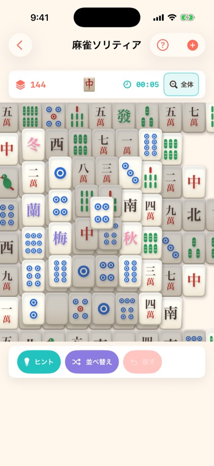
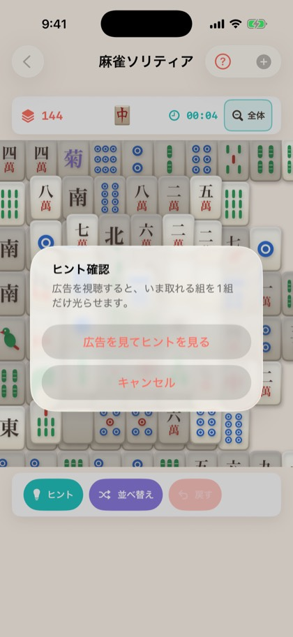

# #336 麻雀ソリティアのヒントを広告制に揃える — 画面確認

iPhone 17 Pro（iOS 26.5・Debug ビルド）で撮影。シミュレータは自動タップができないため、
ダイアログは DEBUG 限定の起動引数 `-solitaireHintConfirm` で出している
（マインスイーパー・ナンプレの `-simulateGiveUp` と同じ理由）。

```sh
xcodebuild -project GameCollection.xcodeproj -scheme GameCollection \
  -configuration Debug -sdk iphonesimulator -destination "id=<UDID>" \
  -derivedDataPath /tmp/duty336-dd CODE_SIGNING_ALLOWED=NO build
xcrun simctl install <UDID> /tmp/duty336-dd/Build/Products/Debug-iphonesimulator/GameCollection.app
# 起動引数は bash で渡す（zsh のインラインだと -startGame が1引数扱いになって無視される）
bash -c "xcrun simctl launch <UDID> com.hirockysan1983.asobiba \
  -screenshotMode -startGame mahjong -solitaireHintConfirm"
```

## hint-button.jpg



プレイ中の操作列。**ボタンの見た目は変えていない**（「ヒント」＝ teal・「並べ替え」＝ purple・
「戻す」＝ coral の 3 つ、高さ 44pt、`ViewThatFits` の 2 段構え）。変わったのは押したあとだけ。

## hint-confirm.jpg



「ヒント」を押すと出る確認ダイアログ。**押した直後に広告は出ない**（突然の広告を出さない、という
並べ替え #324・将棋の「待った」と同じ契約）。

- タイトル「ヒント確認」／本文「広告を視聴すると、いま取れる組を1組だけ光らせます。」
- 「広告を見てヒントを見る」→ リワード広告 → 視聴完了したときだけ 1 組が光る
- 「キャンセル」→ 何も起きない（広告も出ない）

視聴を最後まで見なかった場合は `#64` 統一文言のアラート（「広告を最後まで視聴しなかったか、
広告を読み込めませんでした。」）に落ちる。並べ替えと同じ文字列を使っていることは
`MahjongSolitaireHintAdContractTests` が機械的に確認している。

## 撮らなかった状態とその理由

**「取れる組が無いのでヒントが押せない」状態は撮っていない**。手詰まり（`isDeadlocked`）に
なると `deadlockOverlay` が操作列ごと覆うため、押せないボタンがユーザーから見える経路が無い
（取り切ったあとは操作列自体がリザルト表示に差し替わる）。`.disabled(!model.canHint)` は
覆いに頼らないための二重の歯止めとして入れてあり、**見た目は落としていない**
（薄くしても伝わる相手がいないため）。その代わり Model 側で
`canHint == false` のとき `showHint()` が false を返すことをテストで押さえている。
