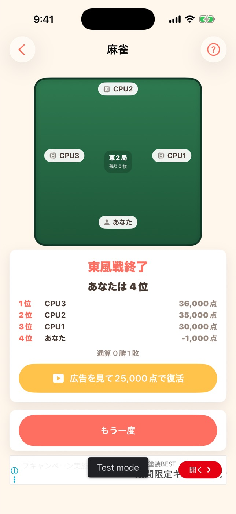

# #338 麻雀（四人打ち）のトビ復活 — 画面確認

iPhone 17（iOS 26.5・Debug ビルド）で撮影。トビ（誰かの持ち点がマイナス）は実プレイでは
稀にしか起きず、シミュレータは自動タップができないため、リザルトは DEBUG 限定の起動引数
`-mahjongBustResult` で出している（麻雀ソリティアの `-solitaireHintConfirm`・
マインスイーパー / ナンプレの `-simulateGiveUp` と同じ理由）。

```sh
xcodebuild -project GameCollection.xcodeproj -scheme GameCollection \
  -configuration Debug -sdk iphonesimulator -destination "id=<UDID>" \
  -derivedDataPath /tmp/dd-338 CODE_SIGNING_ALLOWED=NO build
xcrun simctl install <UDID> /tmp/dd-338/Build/Products/Debug-iphonesimulator/GameCollection.app
# 起動引数は bash で渡す（zsh のインラインだと -startGame が1引数扱いになって無視される）
bash -c "xcrun simctl launch <UDID> com.hirockysan1983.asobiba \
  -startGame mahjong4 -mahjongBustResult"
```

## bust-result.jpg



自分がトビて東風戦が終わったときのリザルト。順位表（自分は -1,000 点で 4 位）と通算記録の下に
**「広告を見て25,000点で復活」**が 1 つ増えている。ポーカー・ブラックジャックの
「広告を見てチップ回復」と同じ位置・同じ見た目（`borderedProminent` / `Theme.yellow` /
`play.rectangle.fill`）に揃えた。その下の「もう一度」は従来どおり。

- 視聴を最後まで見た → マイナスの持ち点が 25,000 点に戻り、**次の局が配られて対局が続く**
- 見なかった / 広告を読み込めなかった → `#64` 統一文言のアラート（「広告を最後まで視聴しなかったか、
  広告を読み込めませんでした。」）が出て、**持ち点は 1 点も戻らない**。ボタンは残るのでもう一度押せる
- 使えるのは**1 半荘に 1 回だけ**。2 度目のトビではこのボタン自体が出ない

画面下の「Test mode」の帯はシミュレータの AdMob テスト広告で、実機・本番では出ない。

## 撮らなかった状態とその理由

**「広告を見た直後の復活後の画面」と「復活できませんでした」アラートは撮っていない**。
どちらも到達にはボタンのタップが要り、シミュレータは自動タップができない（この当番セッションの
制約）。代わりに Model 側で 13 件のテストが押さえている（`MahjongRewardedAdTests`）:
視聴完了で 25,000 点に戻り `.playing` へ進むこと・未視聴なら持ち点も `phase` も変わらないこと・
1 半荘 1 回の制限・記録の巻き戻し。

**CPU だけがトビたときのリザルトも撮っていない**。見た目は変更前と完全に同じ（ボタンが増えない）
ため。この分岐もテストで押さえている。
