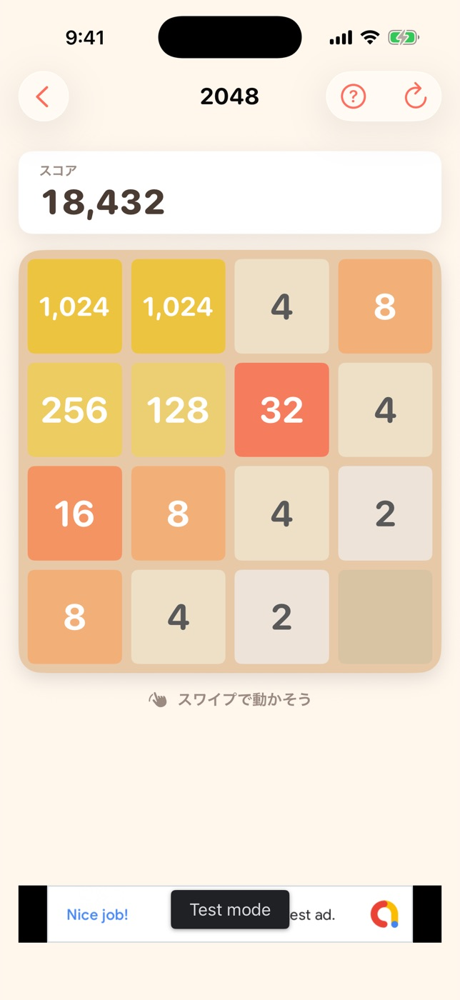
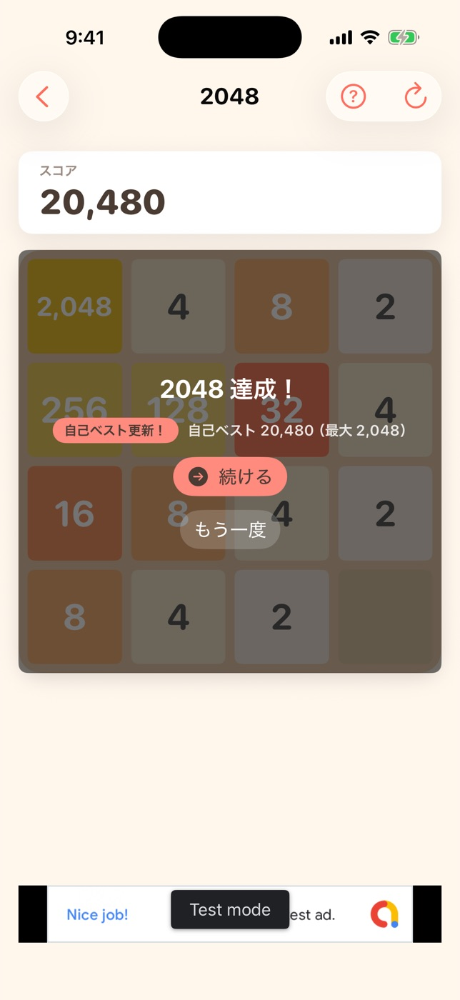

# #438 2048 の勝利演出 — 画面確認

iPhone 17（iOS 26.5・Debug ビルド）で撮影。2048 の到達はスワイプ起点でしか作れず、
シミュレータは自動タップができないため、**中断スナップショットで 1024 を 2 枚並べた盤を注入**し、
DEBUG 限定の起動引数 `-simulate2048Move left` で 1 手だけ動かしている
（マインスイーパーの `-simulateChord`・麻雀の `-mahjongBustResult` と同じ理由）。

```sh
xcodebuild -project GameCollection.xcodeproj -scheme GameCollection \
  -configuration Debug -sdk iphonesimulator -destination "id=<UDID>" \
  -derivedDataPath /tmp/dd-438 CODE_SIGNING_ALLOWED=NO build
xcrun simctl install <UDID> /tmp/dd-438/Build/Products/Debug-iphonesimulator/GameCollection.app

# 1024 が横に 2 枚並んだ盤を中断データとして置く
CONTAINER=$(xcrun simctl get_app_container <UDID> com.hirockysan1983.asobiba data)
cat > "$CONTAINER/Library/Application Support/Snapshots/2048.json" <<'JSON'
{"board":[[1024,1024,4,8],[256,128,32,4],[16,8,4,2],[8,4,2,0]],"score":18432,"continueUsed":false}
JSON

# 起動引数は bash で渡す（zsh のインラインだと -startGame が1引数扱いになって無視される）
bash -c "xcrun simctl launch <UDID> com.hirockysan1983.asobiba \
  -startGame 2048 -simulate2048Move left"
```

## before-1024.jpg（変更前と同じ画）



注入した盤面。左上に 1,024 が 2 枚並んでおり、左へ寄せると 2048 ができる。
スコアは 18,432。

## win-overlay.jpg（この PR で足した画）



左へ 1 手寄せた直後。**2,048 のタイルができ、「2048 達成！」の演出が出ている**。

- スコアは 18,432 → **20,480**（合体ぶんの 2,048 が加算されている）
- その下の 1 行は既存の `RecordLabel`。`outcome: .win` で決着を通知したため
  **「自己ベスト更新！ 自己ベスト 20,480（最大 2,048）」**が出る。この経路が
  評価リクエスト（`outcome == .win` が条件）にも初めて乗る
- **「続ける」**（`borderedProminent` / `Theme.Fill.coral` / 文字は `Theme.onAccent`）は
  ゲームオーバーの「広告を見てコンティニュー」と同じ見た目に揃えた。押すと
  **同じ盤面・同じスコアのまま**続行でき、以後この局では二度と出ない
- **「もう一度」**（`bordered`）はゲームオーバーの同名ボタンと同じ位置・同じ見た目

画面下の「Test mode」の帯はシミュレータの AdMob テスト広告で、実機・本番では出ない。

## 撮らなかった状態とその理由

**「続ける」を押した後の画面は撮っていない**。到達にはボタンのタップが要り、
シミュレータは自動タップができないため（この当番セッションの制約）。
代わりに Model 側のテストが押さえている（`Game2048WinTests`・13 件）:
盤面とスコアが変わらないこと・演出が下りること・同じ局で二度と出ないこと・
中断と復元をまたいでも再発火しないこと・続行ぶんが次の 1 プレイとして数え直されること。
