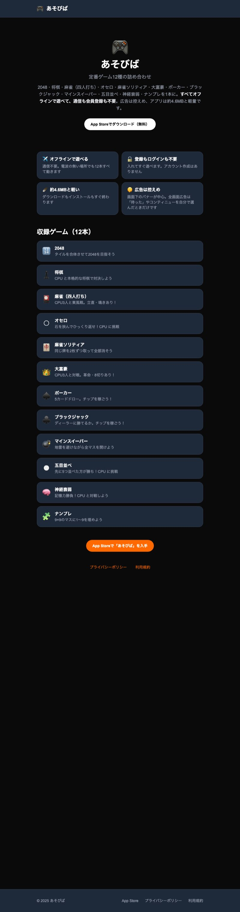

# release/v1.1.1 → main 取り込み: LP の画面確認

v1.1.1 が App Store で公開された（2026-08-29T18:18:43Z）ことに伴い、LP の
「配信予定」ラベル（`comingSoon: true`）を麻雀（四人打ち）とナンプレから外した。

`web` を `npm ci && npm run build` → `npm start -- -p 3117` で立ち上げ、
headless Chrome（`--headless=new --window-size=900,3400 --screenshot`）で撮影。

## lp-top-12released.jpg



- 見出し「収録ゲーム（**12本**）」＋カード12枚（麻雀（四人打ち）3番目・ナンプレ末尾）
- 「通信不要。電波の無い場所でも**12本**すべて動きます」
- **「配信予定」セクションが消えている**（`upcomingGames.length === 0` のため描画されない）

## 機械的な検証

```sh
$ bash Scripts/check-lp-game-list.sh
check-lp-game-list: OK（HEAD の registry 12本と games.ts の配信済み分が一致）

$ ls web/.next/server/app/games/*.html | wc -l
      12   # mahjong4.html / sudoku.html を含む
```
